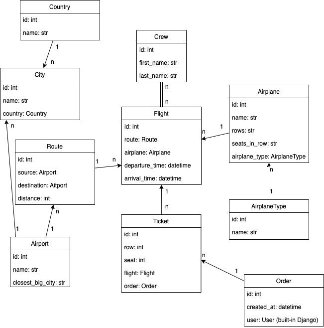

# Airport API Service ✈️🌎📆

## Project Description

A web-based application for managing flights, airplanes, routes, crew assignments and providing users with the ability to book tickets.

## Features

* JWT authentication for secure API access.
* Comprehensive API documentation available at:
  - /api/doc/swagger/ (Swagger UI)
  - /api/doc/redoc/ (ReDoc)
* Manage airplanes, flight schedules, user orders and tickets with flight, row, and seat details.
* Assign crew members to flights.
* Track international routes and airports.
* Django admin panel for data management.
* User interface for browsing available flights and booking tickets easily.

## Technologies Used

Backend: Django Framework  
Database: PostgreSQL  
API: Django REST Framework

## Installation and Usage:
* Install Python 3.9.
* Install PostgreSQL and create db.
* Install Docker.
* Clone the repository.
* Set up environment variables using ".env.sample" as a guide.
* Run the application.
* Feel free to explore and contribute!

```
git clone https://github.com/frank0190/airport-api-service

(for Windows)
python -m venv venv
source venv/Scripts/activate

(for Mac/Linux)
python3 -m venv venv
source venv/bin/activate

python -m pip install --upgrade pip
pip install -r requirements.txt

set DJANGO_SECRET_KEY=<your secret key>
set DJANGO_DEBUG=<your debug value>
set DJANGO_ALLOWED_HOSTS=<your allowed hosts>
set POSTGRES_HOST=<your Postgres host>
set POSTGRES_DB=<your Postgres database>
set POSTGRES_USER=<your Postgres user>
set POSTGRES_PASSWORD=<your Postgres password>

python manage.py makemigrations
python manage.py migrate
python manage.py runserver
```

### Run with Docker:
```
docker-compose build
docker-compose up
```
## DB Structure:



## Getting Access:

* create a user via: /api/user/register
* get access token via: /api/user/token
